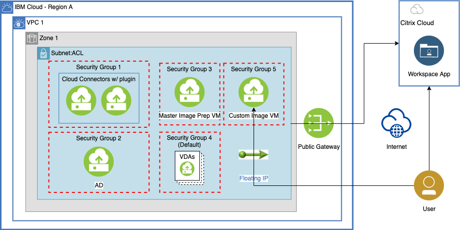

# Citrix DaaS for IBM Virtual Private Cloud

## Overview

This Terraform module deploys the following VPC infrastructure for enabling Citrix DaaS on IBM Cloud:

- VPC
- Subnets
- Public Gateways
- Security Groups
- Active Directory VSIs (Virtual Server Instances)
- Cloud Connector VSIs
- VSI for creating VDA custom image (optional)

We recommend using the IBM Cloud portal WES-UI to deploy Citrix DaaS on IBM Cloud VPC. The WES-UI creates
an IBM Cloud Schematics workspace that points to this Terraform module and deploys your Citrix DaaS
infrastructure. Using Schematics is *no additional cost* and provides a way for you to easily manage
your Terraform lifecycle. See
[IBM Cloud portal WES-UI](https://cloud.ibm.com/wes-ui/citrix-virtual-app-desktop).

For more information on IBM Cloud Schematics, see
[IBM Cloud Schematics](https://cloud.ibm.com/schematics/overview).

You may run this Terraform module locally, supplying the necessary variables. See
[Assigning values to root module variables](https://www.terraform.io/docs/language/values/variables.html#assigning-values-to-root-module-variables).

## Setup Requirements

### Prerequisites

#### Upgrading your IBM Cloud Account

To order and use IBM Cloud services, billing information is required for your account. See
[Upgrading Your Account](https://cloud.ibm.com/docs/account?topic=account-upgrading-account).

#### Verify Citrix and Operating System Entitlements

Verify that you have Citrix Virtual Apps and Desktops license entitlements. Review the requirements
on
[Citrix Cloud](https://citrix.cloud.com/).

#### Install Terraform

If you wish to run Terraform locally, see
[Install Terraform](https://learn.hashicorp.com/tutorials/terraform/install-cli#install-terraform).

#### IBM Cloud API Key

You must supply an IBM Cloud API key so that Terraform can connect to the IBM Cloud Terraform
provider. See
[Create API Key](https://cloud.ibm.com/docs/account?topic=account-userapikey&interface=ui#create_user_key).

#### Enable VRF (optional)

If you would like to have network connection between IBM Cloud VPC and Classic Infrastructure, see
[Enabling VRF](https://cloud.ibm.com/docs/account?topic=account-vrf-service-endpoint&interface=ui#vrf)
. This option is *not* required to deploy Citrix DaaS on IBM Cloud VPC.

#### IBM Cloud Schematics Access Policies

You must create the proper Schematics access policies for a user to deploy Citrix DaaS on IBM Cloud VPC
using the
[WES-UI](https://cloud.ibm.com/wes-ui/citrix-virtual-app-desktop)
or IBM Cloud Schematics. See
[IBM Cloud Schematics Access](https://cloud.ibm.com/docs/schematics?topic=schematics-access).

## Variable Behavior

There are a number of variables defined in variables.tf used by this Terraform module to
deploy and configure your Citrix DaaS infrastructure. This section will describe variable behavior. See
[variables.tf](variables.tf)
for full list of variables with their descriptions, defaults, and conditions.

### Active Directory Topology

#### IBM Cloud

When deploying Citrix DaaS on VPC using IBM Cloud topology, the following
infrastructure will be created by default:

- 1 x VPC
- 1 x /24 Subnet (256 IPs)
- 1 x Public Gateway
- 1 x Active Directory VSI
- 2 x Cloud Connector VSIs
- Custom Image VSI (optional)
- 4 Security Groups (5 if Custom Image VSI deployed)
  - Active Directory VSI
  - Cloud Connector VSIs
  - VDA VSIs
  - Master Image Prep VSI (VSI deployed during Citrix Machine Catalog creation)
  - Custom Image VSI (optional)

Your Active Directory VSI will run AD install, minimally configured, during post-provisioning. See
[AD Cloudbase-Init section](#active-directory).

Your Cloud Connector VSIs will download and install the Cloud Connector software and IBM Cloud VPC
plugin, and join your AD Domain Controller, during post-provisioning. See
[Cloud Connector Cloudbase-Init section](#cloud-connector).

#### Extended (Multisite)

When deploying using Extended topology, the same infrastructure will be created as IBM Cloud
topology [above](#ibm-cloud) , but the AD and Cloud Connector software will not be installed or
configured on your VSIs. You are required to setup your Active Directory VSI and Cloud Connector
VSIs by running the following scripts located in the respective C:\ drive. See
[AD Extended Cloudbase-Init script section](#active-directory-extended).

### Deploy A Custom Image VSI

You have the option to deploy a VSI to use when creating a custom VDA image for your Citrix Machine
Catalog. Set the `deploy_custom_image_vsi` variable to true if you would like to use this option.
You need to attach a Floating IP to the primary NIC of your Custom Image VSI during post deployment
to enable remote access. A Custom Image VSI security group is created, enabling access to the VSI
using RDP on port 3389.

### Profiles

#### Control Plane VSIs

The `control_plane_profile` variable allows you to specify the VSI profile for your Active Directory
and Cloud Connector VSIs. The default is set to cx2-4x8, but can be overridden with any valid VSI
profile.

#### Custom Image VSI

The `custom_image_vsi_profile` variable allows you to specify the VSI profile for your Custom Image
VSI. The default is set to cx2-4x8, but can be overridden with any valid VSI profile.

See
[VSI profiles](https://cloud.ibm.com/docs/vpc?topic=vpc-profiles&interface=ui).

## Security Groups

As part of your Citrix DaaS on VPC deployment, this Terraform module creates the following 4 security
groups:

| Group | Description |
| --- | --- |
| Active Directory | Active Directory VSI |
| Cloud Connector | Cloud Connector VSIs |
| VDA | VDA VSIs that you deploy as part of your Citrix Machine Catalog |
| Master Image Prep | Master Image Prep VSI deployed during Citrix Machine Catalog creation |
| Custom Image (optional) | Custom Image VSI |

Security groups rules are created in accordance with Citrix guidelines. See
[Communication ports used by Citrix](https://docs.citrix.com/en-us/tech-zone/build/tech-papers/citrix-communication-ports.html#citrix-cloud).

## Cloudbase-Init Scripts

This Terraform module defines the `userdata` argument on several `resource` blocks in `main.tf`,
providing VSI configuration on initial boot using
[Cloudbase-Init](https://cloudbase.it/cloudbase-init/). See [main.tf](main.tf).

### Active Directory

When using the IBM Cloud topology, this Terraform module will pass the `ad-userdata.ps1` script into
`resource "ibm_is_instance" "active_directory"` along with variables. The `ad-userdata.ps1` script
installs Active Directory, AD Forest, pre-registers Cloud Connectors, and verifies that your AD
Domain Controller is running. Please note, the script registers more Cloud Connectors than deployed
to allow for creating additional Cloud Connectors using this Terraform module. See
[ad-userdata.ps1](scripts/ad-userdata.ps1).

### Active Directory Extended

When using the Extended topology, this Terraform module will pass the `ad-extended.ps1` script into
`resource "ibm_is_instance" "active_directory"` along with variables. The `ad-extended.ps1` script
installs Active Directory, AD Forest, pre-registers Cloud Connectors, and verifies that your AD
Domain Controller is running. Please note that the script registers more Cloud Connectors than
deployed to allow for creating additional Cloud Connectors using this Terraform module. See
[ad-extended.ps1](scripts/ad-extended.ps1).

### Cloud Connector

This Terraform module will pass the `connector-userdata.ps1` script into
`resource "ibm_is_instance" "connector"` along with variables. The `connector-userdata.ps1`script
installs the Cloud Connector
software and registers the Cloud Connector. The script also joins the Cloud Connector to the AD
domain and installs the IBM Cloud VPC Plugin on the Cloud Connector. See
[connector-userdata.ps1](scripts/connector-userdata.ps1).

### Custom Image

This Terraform module will pass the `custom-image-userdata.ps1` script into
`resource "ibm_is_instance" "custom_image_instance"` along with the ad_ip variable. The
`custom-image-userdata.ps1` script sets the DNS on your Custom Image VSI to the IP of your Active
Directory VSI. See
[custom-image-userdata.ps1](scripts/custom-image-userdata.ps1).

## IBM Cloud VPC Plugin

Citrix Virtual Apps and Desktops for IBM Cloud uses a plugin architecture to add support for new
hypervisors and cloud providers. Partners and vendors can develop their own plugins which will be
recognized by Citrix DaaS. Through a partnership with Citrix, IBM has developed an IBM Cloud VPC plugin
that allows Citrix DaaS customers to manage resources on IBM Cloud VPC.

In order to access restricted resources, whether on-prem or in the cloud, Citrix DaaS requires the use of
an authorized proxy. This is accomplished with the installation of a Cloud Connector, which
is also used by Citrix DaaS plugins that need access to the restricted resources.

This Terraform module downloads the `IBM-CitrixDaaS-plugin.msi` from this repository, then installs and
registers the IBM Cloud VPC Plugin from the msi. See
[Cloud Connector Cloudbase-Init script](#cloud-connector).

## Post Deploy

If you provision a Custom Image VSI, you need to attach a Floating IP to the primary NIC of your
Custom Image VSI during post deployment to enable remote access.

When using the Extended topology, this Terraform module will *not* install Active Directory. You are
responsible for installation and configuration of your multisite Active Directory.

We strongly recommend securing your Active Directory by enabling LDAPS. Follow the Microsoft
guidelines here
[Enabling LDAPS](https://docs.microsoft.com/en-us/troubleshoot/windows-server/identity/enable-ldap-over-ssl-3rd-certification-authority).

We recommend creating Citrix Machine Catalogs totaling no more than 100 VSIs. When creating
catalogs, you can add multiple NICs to the resulting VSIs. Network Security Groups (NSGs) can be
only be assigned to all NICs. That is, you can’t assign different NSGs to different NICs.

To start creating a Citrix Machine Catalog, login to
[Citrix Web Studio](https://xenapp.cloud.com/manage/webstudio)

## Remote Access and Logging

In order to manage your Active Directory or debug VSIs, you will need to reserve and attach a
Floating IP for each VSI NIC you wish to access. See
[Floating IPs for external connectivity](https://cloud.ibm.com/docs/vpc?topic=vpc-about-networking-for-vpc#floating-ip-for-external-connectivity).

The Cloudbase-Init scripts described
[above](#cloudbase-init-scripts)
send log messages to `C:\ProgramData\IBMCitrixDaaS\Logs\IBMCitrixDaaSInstallation.log` on each VSI.
The Cloud Connector VSI also contains a log file from the `IBM-CitrixDaaS-plugin.msi` install at `C:\ProgramData\IBMCitrixDaaS\Logs\msi.log`.

## Dedicated Host

Optionally the user will be able to request dedicated host(s). Dedicated hosts are provisioned per zone and require a dedicated host group per zone. The user will be able to supply a dedicated host profile and quantity. Terraform will create the dedicated host resources and pass, through cloud-init, the dedicated host group ID. The cloud-init script will save this in the Windows registry for the cloud connector plugin to reference later. With that set, the plugin will automatically use the dedicated host group for a placement target of VDAs created with it.

An additional option for dedicated host will allow the user to provision the control plane components on to the dedicated host ordered for VDAs. In this shared configuration the cloud connectors, active directory, and custom image VSIs would use the dedicated host group as their placement target. This option cannot be used without ordering dedicated host for VDA placement at this time.

Using dedicated host groups for instance placement targets, will spread the VSI across the dedicated hosts in the dedicated host groups. Dedicated host groups are zonal, and therefore the spread of instances must be in the group's zone that is targeted. Using a single dedicated host for a Citrix DaaS order should be discouraged, as this would create a single point of failure. Using 2 or more dedicated hosts, residing in more than 1 zone, should be recommended. For more information, see [Dedicated Host Specifics](https://cloud.ibm.com/docs/cvad?topic=cvad-provisioning-cvad-vpc#specifics-vpc-dedhost)

### Dedicated Host Shared Control Plane

The standard dedicated host option for Citrix DaaS on VPC provisions the control plane components, active directory, cloud connectors, and custom image VSI onto public hosts and the VDAs to the dedicated hosts ordered with Citrix DaaS.

With the shared dedicated option the control plane is also provisioned to the dedicated host(s).

Note the dedicated host group is specified when ordering VSIs for Citrix DaaS. In the example below, 2 dedicated hosts are ordered for one zone. When VSI are ordered with a placement target of the dedicated group, the default scheduling algorithm for VPC is used. This will spread the VSI across the dedicated hosts in the group. The placement will appear to be random and offers no control on which hosts the VDAs or control plane are provisioned to.

## Support

If you have problems or questions when using Citrix Virtual Apps and Desktops for IBM Cloud, you can
contact Citrix support. Contact
[Citrix support](https://www.citrix.com/support/).

If you have problems or questions when using the underlying IBM Cloud VPC infrastructure, you can
get help by searching for information or by asking questions through one of the forums. You can also
create a case in the
[IBM Cloud console](https://cloud.ibm.com/unifiedsupport/supportcenter).

For information about opening an IBM support ticket, see
[Contacting support](https://cloud.ibm.com/docs/get-support?topic=get-support-using-avatar).

To report bugs or make feature requests regarding this Terraform module, please create an issue in
this repository.

## Releases

Minor and major releases to this repository will occur on Tuesday / Thursday at 6:00pm Central Time.
Hot patches will be released on demand.

## References

- [What is Terraform](https://www.terraform.io/intro)
- [IBM Cloud provider Terraform getting started](https://cloud.ibm.com/docs/ibm-cloud-provider-for-terraform?topic=ibm-cloud-provider-for-terraform-getting-started)
- [Citrix DaaS docs](https://docs.citrix.com/en-us/citrix-daas)
- [IBM Cloud Schematics](https://cloud.ibm.com/schematics/overview)
- [Citrix DaaS Ordering UI](https://cloud.ibm.com/wes-ui/citrix-virtual-app-desktop)

<!-- BEGINNING OF PRE-COMMIT-TERRAFORM DOCS HOOK -->
## Requirements

| Name | Version |
|------|---------|
|  [terraform](#requirement\_terraform) | >= 1.0.0 |
|  [ibm](#requirement\_ibm) | 1.47.0 |
|  [random](#requirement\_random) | 3.3.2 |

## Providers

| Name | Version |
|------|---------|
|  [ibm](#provider\_ibm) | 1.47.0 |
|  [random](#provider\_random) | 3.3.2 |

## Modules

| Name | Source | Version |
|------|--------|---------|
|  [logdna](#module\_logdna) | ./modules/logdna | n/a |
|  [volume\_worker](#module\_volume\_worker) | ./modules/fortio | n/a |

## Resources

| Name | Type |
|------|------|
| [ibm_is_dedicated_host.host](https://registry.terraform.io/providers/IBM-Cloud/ibm/1.47.0/docs/resources/is_dedicated_host) | resource |
| [ibm_is_dedicated_host_group.dh_group](https://registry.terraform.io/providers/IBM-Cloud/ibm/1.47.0/docs/resources/is_dedicated_host_group) | resource |
| [ibm_is_floating_ip.custom_image_fip](https://registry.terraform.io/providers/IBM-Cloud/ibm/1.47.0/docs/resources/is_floating_ip) | resource |
| [ibm_is_instance.active_directory](https://registry.terraform.io/providers/IBM-Cloud/ibm/1.47.0/docs/resources/is_instance) | resource |
| [ibm_is_instance.connector](https://registry.terraform.io/providers/IBM-Cloud/ibm/1.47.0/docs/resources/is_instance) | resource |
| [ibm_is_instance.custom_image_instance](https://registry.terraform.io/providers/IBM-Cloud/ibm/1.47.0/docs/resources/is_instance) | resource |
| [ibm_is_instance.secondary_active_directory](https://registry.terraform.io/providers/IBM-Cloud/ibm/1.47.0/docs/resources/is_instance) | resource |
| [ibm_is_public_gateway.gateway](https://registry.terraform.io/providers/IBM-Cloud/ibm/1.47.0/docs/resources/is_public_gateway) | resource |
| [ibm_is_security_group.active_directory_sg](https://registry.terraform.io/providers/IBM-Cloud/ibm/1.47.0/docs/resources/is_security_group) | resource |
| [ibm_is_security_group.connector_sg](https://registry.terraform.io/providers/IBM-Cloud/ibm/1.47.0/docs/resources/is_security_group) | resource |
| [ibm_is_security_group.custom_image_sg](https://registry.terraform.io/providers/IBM-Cloud/ibm/1.47.0/docs/resources/is_security_group) | resource |
| [ibm_is_security_group.master_prep_sg](https://registry.terraform.io/providers/IBM-Cloud/ibm/1.47.0/docs/resources/is_security_group) | resource |
| [ibm_is_security_group_rule.egress_active_directory_all](https://registry.terraform.io/providers/IBM-Cloud/ibm/1.47.0/docs/resources/is_security_group_rule) | resource |
| [ibm_is_security_group_rule.egress_connector_all](https://registry.terraform.io/providers/IBM-Cloud/ibm/1.47.0/docs/resources/is_security_group_rule) | resource |
| [ibm_is_security_group_rule.egress_custom_image_all](https://registry.terraform.io/providers/IBM-Cloud/ibm/1.47.0/docs/resources/is_security_group_rule) | resource |
| [ibm_is_security_group_rule.ingress_active_directory_from_active_directory_all](https://registry.terraform.io/providers/IBM-Cloud/ibm/1.47.0/docs/resources/is_security_group_rule) | resource |
| [ibm_is_security_group_rule.ingress_active_directory_from_connector_all](https://registry.terraform.io/providers/IBM-Cloud/ibm/1.47.0/docs/resources/is_security_group_rule) | resource |
| [ibm_is_security_group_rule.ingress_active_directory_from_custom_image_tcp](https://registry.terraform.io/providers/IBM-Cloud/ibm/1.47.0/docs/resources/is_security_group_rule) | resource |
| [ibm_is_security_group_rule.ingress_active_directory_from_custom_image_udp](https://registry.terraform.io/providers/IBM-Cloud/ibm/1.47.0/docs/resources/is_security_group_rule) | resource |
| [ibm_is_security_group_rule.ingress_active_directory_from_vda_all](https://registry.terraform.io/providers/IBM-Cloud/ibm/1.47.0/docs/resources/is_security_group_rule) | resource |
| [ibm_is_security_group_rule.ingress_connector_from_active_directory_all](https://registry.terraform.io/providers/IBM-Cloud/ibm/1.47.0/docs/resources/is_security_group_rule) | resource |
| [ibm_is_security_group_rule.ingress_connector_from_connector_all](https://registry.terraform.io/providers/IBM-Cloud/ibm/1.47.0/docs/resources/is_security_group_rule) | resource |
| [ibm_is_security_group_rule.ingress_connector_from_vda_all](https://registry.terraform.io/providers/IBM-Cloud/ibm/1.47.0/docs/resources/is_security_group_rule) | resource |
| [ibm_is_security_group_rule.ingress_custom_image_tcp](https://registry.terraform.io/providers/IBM-Cloud/ibm/1.47.0/docs/resources/is_security_group_rule) | resource |
| [ibm_is_security_group_rule.ingress_vda_from_active_directory_all](https://registry.terraform.io/providers/IBM-Cloud/ibm/1.47.0/docs/resources/is_security_group_rule) | resource |
| [ibm_is_security_group_rule.ingress_vda_from_connector_all](https://registry.terraform.io/providers/IBM-Cloud/ibm/1.47.0/docs/resources/is_security_group_rule) | resource |
| [ibm_is_subnet.subnets](https://registry.terraform.io/providers/IBM-Cloud/ibm/1.47.0/docs/resources/is_subnet) | resource |
| [ibm_is_vpc.vpc](https://registry.terraform.io/providers/IBM-Cloud/ibm/1.47.0/docs/resources/is_vpc) | resource |
| [ibm_is_vpc_address_prefix.prefixes](https://registry.terraform.io/providers/IBM-Cloud/ibm/1.47.0/docs/resources/is_vpc_address_prefix) | resource |
| [random_password.ad_join_pwd](https://registry.terraform.io/providers/hashicorp/random/3.3.2/docs/resources/password) | resource |
| [random_string.resource_identifier](https://registry.terraform.io/providers/hashicorp/random/3.3.2/docs/resources/string) | resource |
| [ibm_is_image.custom_image_windows](https://registry.terraform.io/providers/IBM-Cloud/ibm/1.47.0/docs/data-sources/is_image) | data source |
| [ibm_is_image.windows](https://registry.terraform.io/providers/IBM-Cloud/ibm/1.47.0/docs/data-sources/is_image) | data source |
| [ibm_is_ssh_key.ssh_key_id](https://registry.terraform.io/providers/IBM-Cloud/ibm/1.47.0/docs/data-sources/is_ssh_key) | data source |
| [ibm_resource_group.citrix_daas](https://registry.terraform.io/providers/IBM-Cloud/ibm/1.47.0/docs/data-sources/resource_group) | data source |

## Inputs

| Name | Description | Type | Default | Required |
|------|-------------|------|---------|:--------:|
|  [accept\_license](#input\_accept\_license) | Must be set true to accept IBM Cloud VPC Plugin for Citrix Virtual Apps and Desktop license agreement. [Learn more](https://www-40.ibm.com/software/sla/sladb.nsf/displayLIs/296A608D9ACE1F7900258832004E90A0?OpenDocument). You are accepting [License](https://www-40.ibm.com/software/sla/sladb.nsf/displayLIs/339A16A1DEC937F70025886A00497C8E?OpenDocument) if deploying volume worker. | `bool` | `false` | no |
|  [active\_directory\_domain\_name](#input\_active\_directory\_domain\_name) | Active Directory domain name | `string` | n/a | yes |
|  [active\_directory\_safe\_mode\_password](#input\_active\_directory\_safe\_mode\_password) | Safe mode password for the Active Directory administrator account. [Learn more for password complexity](https://docs.microsoft.com/en-us/windows/security/threat-protection/security-policy-settings/password-must-meet-complexity-requirements) | `string` | n/a | yes |
|  [active\_directory\_topology](#input\_active\_directory\_topology) | There are two topologies named IBM Cloud and Extended supported currently | `string` | `"IBM Cloud"` | no |
|  [active\_directory\_vsi\_name](#input\_active\_directory\_vsi\_name) | Appended name of the created VSI | `string` | `"ad"` | no |
|  [address\_prefix\_cidrs](#input\_address\_prefix\_cidrs) | Address prefixes to create in the VPC | `list(string)` | `[]` | no |
|  [basename](#input\_basename) | Basename of the created resource | `string` | `"daas"` | no |
|  [boot\_volume\_capacity](#input\_boot\_volume\_capacity) | Boot volume capacity for custom image and the instances created through Citrix Machine Creation Services. | `number` | `100` | no |
|  [citrix\_api\_key\_client\_id](#input\_citrix\_api\_key\_client\_id) | The Citrix Cloud API key client id needed to connect to Citrix | `string` | n/a | yes |
|  [citrix\_api\_key\_client\_secret](#input\_citrix\_api\_key\_client\_secret) | The Citrix Cloud API key client secret needed to connect to Citrix | `string` | n/a | yes |
|  [citrix\_customer\_id](#input\_citrix\_customer\_id) | The Citrix Cloud customer id needed to connect to Citrix | `string` | n/a | yes |
|  [connector\_per\_zone](#input\_connector\_per\_zone) | Number of connector instances per zone | `number` | `2` | no |
|  [control\_plane\_profile](#input\_control\_plane\_profile) | Profile to use for creating Active Directory and Cloud Connector VSIs | `string` | `"cx2-4x8"` | no |
|  [custom\_image\_vsi\_image\_name](#input\_custom\_image\_vsi\_image\_name) | Provide image name to be used for creating custom image VSI. | `string` | `"ibm-windows-server-2022-full-standard-amd64-4"` | no |
|  [custom\_image\_vsi\_profile](#input\_custom\_image\_vsi\_profile) | Profile to use for creating custom image VSI | `string` | `"cx2-4x8"` | no |
|  [dedicated\_control\_plane](#input\_dedicated\_control\_plane) | Provision control plane virtual server instances (active directory, cloud connector, custom image) on dedicated host groups provisioned with `dedicated_host_per_zone` and `dedicated_host_profile`. Requires `custom_image_vsi_profile` and `control_plane_profile` to use the same profile family and class as `dedicated_host_profile`. | `bool` | `false` | no |
|  [dedicated\_host\_per\_zone](#input\_dedicated\_host\_per\_zone) | Number of dedicated hosts per zone. VDAs for these resource locations will be provisioned to dedicated hosts. Please ensure your VPC vCPU qouta is sufficient. All dedicated host vCPU will count against regional qouta, even while not allocated by VDAs. | `number` | `0` | no |
|  [dedicated\_host\_profile](#input\_dedicated\_host\_profile) | Profile used for each 'dedicated\_host\_per\_zone'. The dedicated host profile family must match the family to be used by VDAs. Dedicated hosts with instance storage are not supported at this time. | `string` | `""` | no |
|  [deploy\_custom\_image\_fip](#input\_deploy\_custom\_image\_fip) | Deploy Floating IP to be used with custom image VSI when set to true | `bool` | `false` | no |
|  [deploy\_custom\_image\_vsi](#input\_deploy\_custom\_image\_vsi) | Deploy VSI for creating a custom image to be used for master image when set to true | `bool` | `false` | no |
|  [deploy\_volume\_worker](#input\_deploy\_volume\_worker) | Enable the volume worker, uses FaaS to create workers for disk creation | `bool` | `false` | no |
|  [ibmcloud\_account\_id](#input\_ibmcloud\_account\_id) | The IBM Cloud account id needed to create a hosting connection from Citrix. | `string` | n/a | yes |
|  [ibmcloud\_api\_key](#input\_ibmcloud\_api\_key) | The IBM Cloud platform API key needed to deploy IAM enabled resources | `string` | n/a | yes |
|  [ibmcloud\_ssh\_key\_name](#input\_ibmcloud\_ssh\_key\_name) | The IBM Cloud platform SSH key name used to deploy Citrix DaaS instances | `string` | n/a | yes |
|  [identity\_volume\_encryption\_crn](#input\_identity\_volume\_encryption\_crn) | Identity volume encryption key crn to encrypt the identity disk. | `string` | `""` | no |
|  [logdna\_enable\_platform](#input\_logdna\_enable\_platform) | Enables logging for the volume worker manager on LogDNA instance. Only one instance of LogDNA per region can be enabled for platform logs. See [Cloud Docs](https://cloud.ibm.com/docs/cvad?topic=cvad-post-provisioning-cvad-vpc#cvad-post-prov-vpc-logging) | `bool` | `false` | no |
|  [logdna\_ingestion\_key](#input\_logdna\_ingestion\_key) | Provide existing LogDNA instance ingestion key. If not set, a new instance of LogDNA will be created when `logdna_integration` is true. | `string` | `""` | no |
|  [logdna\_integration](#input\_logdna\_integration) | Set to false if LogDNA not needed, only recommend disabling for non-production environments. | `bool` | `false` | no |
|  [logdna\_name](#input\_logdna\_name) | Name for LogDNA Instance. Random name will be generated if not set. | `string` | `""` | no |
|  [logdna\_plan](#input\_logdna\_plan) | Service plan used for new LogDNA instance. | `string` | `"7-day"` | no |
|  [logdna\_tags](#input\_logdna\_tags) | Tags for new LogDNA instance. | `list(string)` | <pre>[   "daas",   "logging" ]</pre> | no |
|  [personal\_access\_token](#input\_personal\_access\_token) | Personal access token, Internal IBM use only | `string` | `""` | no |
|  [plugin\_download\_url](#input\_plugin\_download\_url) | Deprecated, use `repository_download_url` | `string` | `""` | no |
|  [region](#input\_region) | IBM Cloud region where all resources will be deployed | `string` | n/a | yes |
|  [repository\_download\_url](#input\_repository\_download\_url) | Used by Cloud Connector setup to download IBM Cloud VPC plugin. | `string` | `"https://api.github.com/repos/IBM-Cloud/citrix-daas"` | no |
|  [repository\_reference](#input\_repository\_reference) | Reference of repository at which to download | `string` | `"master"` | no |
|  [resource\_group](#input\_resource\_group) | The IBM resource group name to be associated with this IBM Cloud VPC Citrix DaaS deployment | `string` | n/a | yes |
|  [resource\_location\_names](#input\_resource\_location\_names) | The Citrix resource location name to be associated with this IBM Cloud VPC Citrix DaaS deployment | `list(string)` | n/a | yes |
|  [sites](#input\_sites) | Site names to be used for active directory servers of different zones | `list(string)` | `[]` | no |
|  [subnet\_cidrs](#input\_subnet\_cidrs) | Subnet cidrs to use in each zone, required when using `address_prefix_cidrs` | `list(string)` | `[]` | no |
|  [subnet\_ipv4\_count](#input\_subnet\_ipv4\_count) | Count of ipv4 address in each zone, ignored when using `address_prefix_cidrs` | `number` | `256` | no |
|  [vda\_security\_group\_name](#input\_vda\_security\_group\_name) | Name for security group created for VDAs | `string` | `"vda-sg"` | no |
|  [zones](#input\_zones) | IBM Cloud zone name within the selected region where the Citrix DaaS infrastructure should be deployed. [Learn more](https://cloud.ibm.com/docs/vpc?topic=vpc-creating-a-vpc-in-a-different-region#get-zones-using-the-cli) | `list(string)` | n/a | yes |

## Outputs

No outputs.
<!-- END OF PRE-COMMIT-TERRAFORM DOCS HOOK -->
